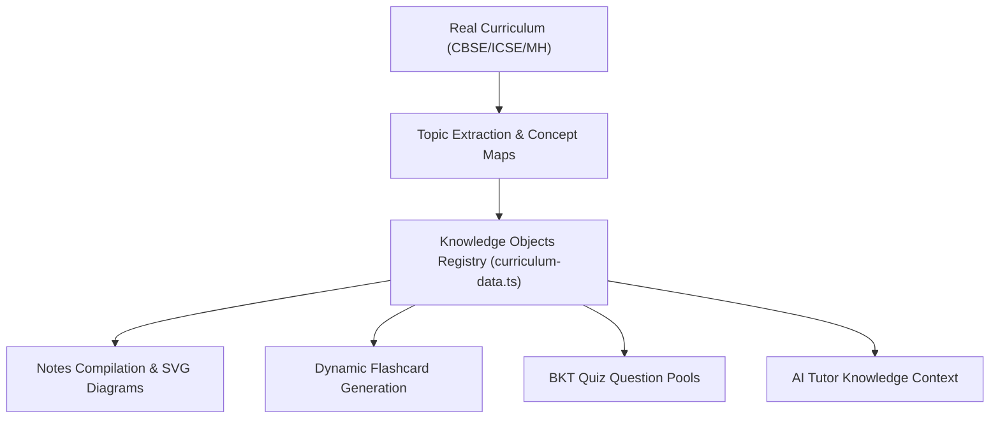

# PathWise — AI Content Pipeline & Solver

Pathwise implements a deterministic curriculum intelligence pipeline. Instead of relying on raw runtime AI generation which can produce generic questions, placeholder formulas, or conversational evasion, Pathwise compiles outputs from a curated static **Knowledge Graph** registry.

This document outlines the pipeline architecture, text compilation rules, mathematical equation solvers, and the content validation system.

---

## 1. Content Pipeline Architecture
The generation flows from seeded structures down to student analytics, ensuring curriculum alignment at every tier.



Every chapter's database record contains:
* **Definitions**: Precise vocabulary mappings.
* **Theories & Laws**: Specific explanations and formulations.
* **Formulas**: LaTeX equations.
* **Worked Problems**: Numerical examples with step-by-step solutions.
* **Common Mistakes**: Academic warnings with corrections and explanations.
* **Inline Vector SVG Diagrams**: Graphical maps matching the active concepts.

---

## 2. Dynamic Questions & Flashcards Generation
To maintain offline availability and ensure high-fidelity diagnostic items, Pathwise generates quizzes and cards deterministically from the knowledge registry:

### 1. Flashcard Extraction
The generator transforms knowledge objects:
- **Formula object** $\rightarrow$ Front: *"What is the equation for [Formula Name]?"* | Back: `$$[Equation]$$` and explanation.
- **Common Mistake** $\rightarrow$ Front: *"How do you avoid the mistake: '[Mistake]'?"* | Back: Correction details.
- **Definitions** $\rightarrow$ Front: *"Define [Term]?"* | Back: Concept description.

### 2. Quiz MCQ Expansion
To ensure a robust pool of 22+ questions per chapter:
- Generates formula identification questions.
- Generates True/False common mistake validation checks.
- Generates fill-in-the-blank terminology questions.
- **De-duplication Guard**: Inspects distractors. If any duplicate option occurs, it appends unique variables to guarantee distinct choices.
- **Option Shuffling**: Shuffles choices randomly using the Fisher-Yates algorithm so the correct answer is distributed across Options A, B, C, and D.

---

## 3. Mathematical Equation Solver
The AI Tutor Router incorporates a parser in [`src/lib/ai-engine.ts`](../src/lib/ai-engine.ts) to solve student doubts. It intercepts algebra queries and solves them step-by-step:

### 1. Linear Equations ($ax + b = c$)
Calculates subtraction and division steps, rendering outputs in LaTeX format:
$$\text{Solve: } 3x + 6 = 18 \implies 3x = 12 \implies x = 4$$

### 2. Quadratic Equations ($ax^2 + bx + c = 0$)
Calculates the discriminant $D = b^2 - 4ac$ and applies the quadratic formula:
$$x = \frac{-b \pm \sqrt{b^2 - 4ac}}{2a}$$

### 3. Simultaneous Linear Systems
Solves simultaneous equations with two variables using Cramer's determinant rule:
$$D = a_1b_2 - a_2b_1, \quad x = \frac{D_x}{D}, \quad y = \frac{D_y}{D}$$

---

## 4. Content Validation Guard
Before notes or questions are saved or displayed, they pass through a validation filter. This screen catches any placeholder text or incomplete variables.

### The Validation Rules
1. Inspects outputs using regex matching:
   ```typescript
   const placeholderRegex = /placeholder|todo|block_|dummy|lorem/i;
   ```
2. If a placeholder token is found, the system rejects the string and triggers the structured fallback database generator, ensuring the student never sees raw scaffold markers.

This is executed in `validateContentOrFallback` in `ai-engine.ts`:

```typescript
export function validateContentOrFallback(content: string, fallback: string): string {
  if (/placeholder|todo|block_|dummy|lorem/i.test(content)) {
    console.warn('Content Validation Alert: Placeholder detected. Activating curriculum fallback...');
    return fallback.replace(/__BLOCK_MATH_PLACEHOLDER_\d+__/g, '').replace(/BLOCK_MATH_PLACEHOLDER/g, '');
  }
  return content;
}
```
---

## 5. AI Tutor Direct Response Routing
The AI Tutor router processes student inputs using a strict query router:
* **Idle / Basic Greeting**: If message is empty or matches simple greeting tags ("hello", "hi"), return the Gyani mascot greeting.
* **Math Queries**: If query contains mathematical expressions, route to `solveExpressionStepByStep`.
* **Concept Search**: Scan the active chapter's knowledge graph for terms. If matched, immediately return the associated definition, formula sheet, SVG diagram, or worked example.
* **Global Academic Queries**: Match topics like "Newton's laws", "chemical reaction balancing", or "pH scale" to direct academic answers.
* **Evasion Emitters**: Bypasses the "I am Gyani" intro card when a student question is present, guaranteeing immediate responses to concept queries.
