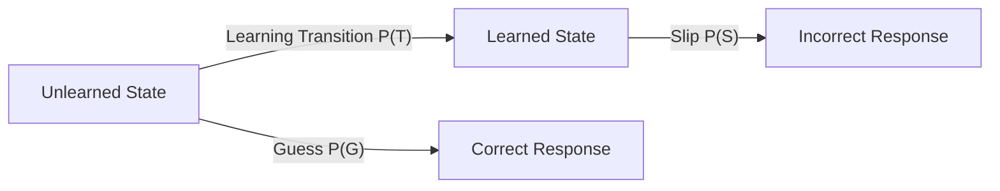

# PathWise — Bayesian Knowledge Tracing (BKT) Model

Bayesian Knowledge Tracing (BKT) is a machine learning algorithm used to model a student's cognitive mastery of specific skills or concept tags over time. This guide covers the mathematical framework, calibration profiles, and system code implementations in Pathwise.

---

## 1. Theoretical Framework
BKT represents a student's learning state as a Hidden Markov Model (HMM) where the student's actual knowledge is a binary latent variable: **Unlearned** ($0$) or **Learned** ($1$). 



At any query node $t$, the system updates the probability of mastery $P(L_t)$ depending on whether the student answered the diagnostic question correctly or incorrectly.

### The Four Core Parameters
1. **$P(L_0)$ (Prior/Initial Knowledge)**: Probability the student understands the skill before practicing any questions. Default value is `0.10`.
2. **$P(T)$ (Transition/Learning Rate)**: Probability the student transitions from the unlearned to the learned state after solving a practice item. Default value is `0.10`.
3. **$P(S)$ (Slip)**: Probability the student makes an accidental error despite knowing the concept. Default value is `0.10`.
4. **$P(G)$ (Guess)**: Probability the student guesses the correct answer despite not knowing the concept. Default value is `0.25` (calibrated for 4-option MCQs).

---

## 2. BKT Update Mathematics

### Step 1: Posterior Probability Update
Depending on the student's answer correctness, the system computes the conditional probability of mastery before the learning transition.

#### If the response is CORRECT:
$$P(L_{t-1} | \text{Correct}) = \frac{P(L_{t-1}) \cdot (1 - P(S))}{P(L_{t-1}) \cdot (1 - P(S)) + (1 - P(L_{t-1})) \cdot P(G)}$$

#### If the response is INCORRECT:
$$P(L_{t-1} | \text{Incorrect}) = \frac{P(L_{t-1}) \cdot P(S)}{P(L_{t-1}) \cdot P(S) + (1 - P(L_{t-1})) \cdot (1 - P(G))}$$

### Step 2: Learning Transition Update
The new mastery probability $P(L_t)$ incorporates the transition probability $P(T)$ for the unmastered portion:
$$P(L_t) = P(L_{t-1} | \text{Obs}) + (1 - P(L_{t-1} | \text{Obs})) \cdot P(T)$$

---

## 3. Code Implementation

The math is executed in [`src/lib/bkt.ts`](../src/lib/bkt.ts):

```typescript
import type { BKTMastery } from '../types';

export interface BKTParams {
  pKnow: number;
  pTransit: number;
  pSlip: number;
  pGuess: number;
}

export interface BKTUpdateResult {
  pKnow: number;
  isMastered: boolean;
  confidence: number;
}

/**
 * Computes standard BKT equation updates.
 */
export function updateBKT(
  params: BKTParams,
  isCorrect: boolean
): BKTUpdateResult {
  const { pKnow, pTransit, pSlip, pGuess } = params;
  let pLnGivenObs: number;

  // Step 1: Calculate posterior mastery based on correctness
  if (isCorrect) {
    const numerator = pKnow * (1 - pSlip);
    const denominator = pKnow * (1 - pSlip) + (1 - pKnow) * pGuess;
    pLnGivenObs = denominator > 0 ? numerator / denominator : pKnow;
  } else {
    const numerator = pKnow * pSlip;
    const denominator = pKnow * pSlip + (1 - pKnow) * (1 - pGuess);
    pLnGivenObs = denominator > 0 ? numerator / denominator : pKnow;
  }

  // Step 2: Apply transition coefficient (unlearned to learned transition)
  const pKnowNew = pLnGivenObs + (1 - pLnGivenObs) * pTransit;

  // Clamp values to prevent numerical instability [0.001, 0.999]
  const clamped = Math.max(0.001, Math.min(0.999, pKnowNew));

  return {
    pKnow: clamped,
    isMastered: clamped >= 0.95, // 95% threshold denotes mastery
    confidence: Math.abs(clamped - 0.5) * 2, // Scales from 0 to 1
  };
}
```

---

## 4. Adaptive Zone of Proximal Development (ZPD) Recommendation
Pathwise uses BKT updates to calculate the student's *Zone of Proximal Development*. The target difficulty matches the student's learning sweet spot, seeking to maintain an average correct response rate of approximately 70-75%.

The recommended difficulty coefficient maps inverse to $P(L_t)$:
$$\text{Recommended Difficulty} = \max\left(0.1, \min\left(0.9, 1 - (P(L_t) \cdot 0.6 + 0.2)\right)\right)$$

This is implemented in `recommendDifficulty(pKnow)`:
- **Mastery > 80%**: Increase question difficulty to challenge the student.
- **Mastery 40% - 80%**: Sweet spot; maintain average difficulty levels.
- **Mastery < 40%**: Decrease difficulty and offer hints to avoid frustration.
