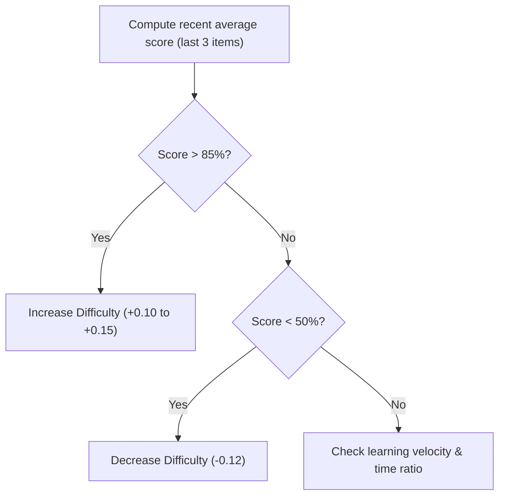

# PathWise — Dynamic Difficulty Adaptation Engine

Pathwise dynamically adjusts academic material difficulty to align with the student's *Zone of Proximal Development* (ZPD). The target success threshold is set between **65% and 80%** to ensure learning remains engaging but not overly frustrating.

This document details the adaptation rules, mathematics, velocity trends, and the TypeScript implementation of the engine.

---

## 1. Context Input Variables
The engine computes adjustments based on a `DifficultyContext` snapshot:
* **`currentDifficulty`**: The current difficulty value (on a scale of `0.05` to `0.95`).
* **`recentScores`**: Array of the student's last $N$ quiz scores (each between `0` and `1`).
* **`pKnow`**: The latent BKT mastery probability.
* **`avgTimeRatio`**: The ratio of actual time taken to expected time taken.

---

## 2. Adaptation Logic & Thresholds



### Core Progression Rules
1. **High Performance**: If the average of the last 3 quiz scores ($A_3$) exceeds `0.85`, increase difficulty:
   $$\text{Change} = 0.10 + (P(L_n) > 0.8 \ ? \ 0.05 : 0)$$
2. **Struggling Performance**: If $A_3$ falls below `0.50`, decrease difficulty:
   $$\text{Change} = -0.12$$
3. **Steady Competency**: If $A_{\text{recent}} > 0.70$ and $P(L_n) > 0.7$, raise difficulty by $+0.05$ to push the boundary.
4. **Time Ratio Overload Dampener**: If the student's speed ratio exceeds `1.5` (taking 50% longer than expected), any positive difficulty increase is halved:
   $$\text{Change} = \text{Change} \cdot 0.5$$

---

## 3. Learning Velocity Calculations
The engine calculates *Learning Velocity* ($V$) to track performance trends over time. The historical score sequence is split into halves, and their averages are compared:

$$V = \mu_{\text{recent\_half}} - \mu_{\text{older\_half}}$$

* **Positive Velocity ($V > 0.10$)**: Indicates student progress, triggering a $+0.05$ difficulty adjustment.
* **Negative Velocity ($V < -0.15$)**: Indicates performance fatigue, triggering a $-0.08$ adjustment.

---

## 4. Code Implementation

This is executed inside [`src/lib/difficulty.ts`](../src/lib/difficulty.ts):

```typescript
import { clamp } from './utils';

export interface DifficultyContext {
  currentDifficulty: number;
  recentScores: number[];
  pKnow: number;
  avgTimeRatio: number;
  sessionCount: number;
}

export function adaptDifficulty(ctx: DifficultyContext) {
  const { currentDifficulty, recentScores, pKnow, avgTimeRatio } = ctx;

  if (recentScores.length === 0) {
    return { newDifficulty: currentDifficulty, direction: 'same', reason: 'Not enough data' };
  }

  // Calculate score averages
  const recentN = recentScores.slice(-5);
  const avgScore = recentN.reduce((s, v) => s + v, 0) / recentN.length;
  
  const last3 = recentScores.slice(-3);
  const avg3 = last3.length > 0 ? last3.reduce((s, v) => s + v, 0) / last3.length : avgScore;

  // Compute learning velocity trends
  let velocity = 0;
  if (recentScores.length >= 3) {
    const firstHalf = recentScores.slice(0, Math.floor(recentScores.length / 2));
    const secondHalf = recentScores.slice(Math.floor(recentScores.length / 2));
    velocity = (secondHalf.reduce((s, v) => s + v, 0) / secondHalf.length) -
               (firstHalf.reduce((s, v) => s + v, 0) / firstHalf.length);
  }

  let adjustment = 0;
  let reason = '';

  if (avg3 > 0.85) {
    adjustment = 0.10 + (pKnow > 0.8 ? 0.05 : 0);
    reason = 'Excellent recent performance';
  } else if (avg3 < 0.50) {
    adjustment = -0.12;
    reason = 'Struggling with current level';
  } else if (avgScore > 0.70 && pKnow > 0.7) {
    adjustment = 0.05;
    reason = 'Strong knowledge foundation, ready for challenge';
  } else if (velocity > 0.1) {
    adjustment = 0.05;
    reason = 'Showing improvement trend';
  } else if (velocity < -0.15) {
    adjustment = -0.08;
    reason = 'Performance declining, reducing load';
  } else {
    reason = 'Maintaining current level';
  }

  // Apply speed dampener to prevent over-challenging slower readers
  if (avgTimeRatio > 1.5 && adjustment > 0) {
    adjustment *= 0.5;
    reason += ' (tempered due to pace)';
  }

  const maxStep = 0.15;
  const clampedAdjustment = clamp(adjustment, -maxStep, maxStep);
  const newDifficulty = clamp(currentDifficulty + clampedAdjustment, 0.05, 0.95);

  const direction = clampedAdjustment > 0.01 ? 'harder' :
                    clampedAdjustment < -0.01 ? 'easier' : 'same';

  return { newDifficulty, direction, reason };
}
```
---

## 5. Visual Mapping Variables
The frontend maps the output difficulty scale (`0.0` - `1.0`) to text tags and warning colors for the user dashboard:
- **`Very Easy`** ($D < 0.2$): Rendered in Green (`var(--color-success)`).
- **`Easy`** ($0.2 \le D < 0.4$): Rendered in Green (`var(--color-success)`).
- **`Medium`** ($0.4 \le D < 0.6$): Rendered in Amber (`var(--color-warning)`).
- **`Hard`** ($0.6 \le D < 0.8$): Rendered in Red (`var(--color-error)`).
- **`Very Hard`** ($D \ge 0.8$): Rendered in Red (`var(--color-error)`).
