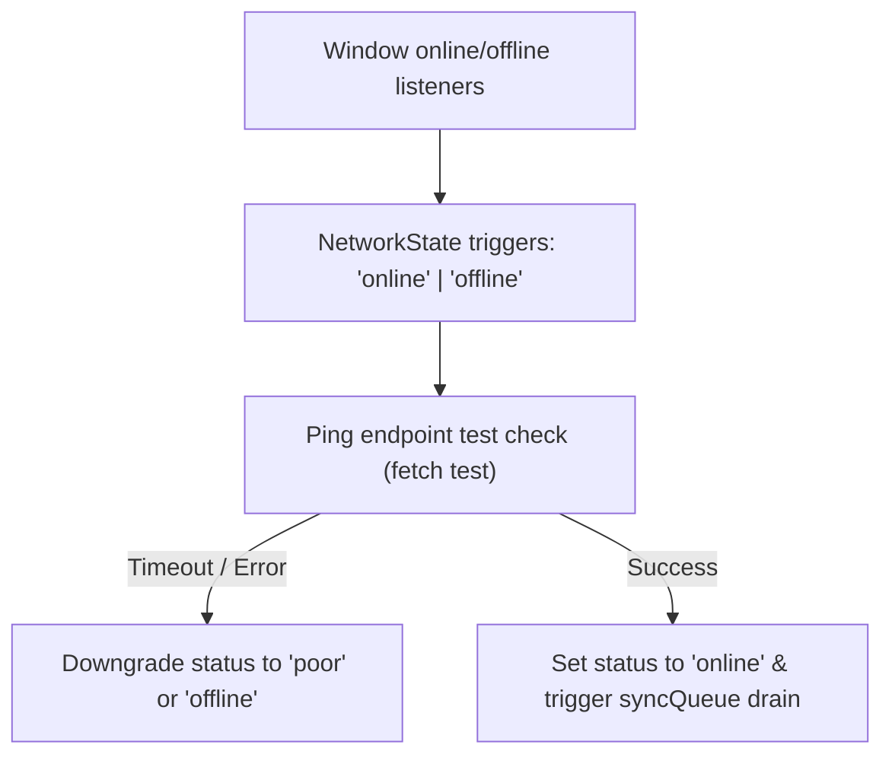

# Pathwise — Offline Synchronization Architecture

Pathwise employs a robust, client-first offline architecture. Students and teachers can perform all core actions (reading notes, completing quizzes, swiping flashcards, and writing reply comments) without an internet connection. 

This document details the database synchronization queue, network status detection triggers, synchronization mechanisms, and conflict resolution rules.

---

## 1. Network Status Detection
The system tracks connectivity in [network.ts](file:///c:/Users/Arnav/OneDrive/Desktop/better/src/lib/network.ts) using standard browser events and active endpoint ping checks.



---

## 2. The Sync Queue Database Schema
The IndexedDB table `syncQueue` holds outgoing synchronization operations.

```typescript
export interface SyncQueueItem {
  id: string;              // Primary UUID
  operation: 'CREATE' | 'UPDATE' | 'DELETE';
  tableName: string;       // Target Dexie store (e.g. 'quizAttempts', 'doubtReplies')
  recordId: string;        // ID of target local record
  payload: Record<string, unknown>; // Data payload
  priority: number;        // Higher priority processed first
  status: 'pending' | 'syncing' | 'synced' | 'failed';
  retryCount: number;      // Maximum 5 retries before pausing
  createdAt: number;
  lastAttemptAt?: number;
}
```

---

## 3. Synchronization Pipeline & Queue Draining
When the network state switches to `online` or a manual sync is clicked, the synchronization loop drains the queue.

### Sync Queue Processor Loop
```typescript
import { db } from './db';
import { getNetworkState } from './network';

export async function processSyncQueue(): Promise<void> {
  const state = getNetworkState();
  if (state !== 'online') return;

  // Retrieve pending queue items sorted by priority and age
  const pendingItems = await db.syncQueue
    .where('status')
    .equals('pending')
    .sortBy('priority');

  for (const item of pendingItems) {
    item.status = 'syncing';
    item.lastAttemptAt = Date.now();
    await db.syncQueue.put(item);

    try {
      // Simulate pushing payload to remote REST API
      await pushPayloadToRemote(item.tableName, item.operation, item.payload);
      
      // Mark as completed
      item.status = 'synced';
      await db.syncQueue.delete(item.id); // Remove from queue upon success
    } catch (err) {
      item.retryCount += 1;
      item.status = item.retryCount >= 5 ? 'failed' : 'pending';
      await db.syncQueue.put(item);
      console.error(`Sync failed for item ${item.id}, retry count: ${item.retryCount}`, err);
    }
  }
}

async function pushPayloadToRemote(table: string, op: string, payload: any) {
  // Mock API post handler
  return new Promise((resolve) => setTimeout(resolve, 300));
}
```

---

## 4. Conflict Resolution Rules
Pathwise operates on a **Client-Wins / Last-Write-Wins (LWW)** conflict resolution model.

### 1. High-Trust Client State
Because learning metrics are calculated on the student's personal device, the local mastery updates, SM-2 retention ratings, and XP states are trusted. The server accepts local database states during sync without comparison validation.

### 2. Comment / Doubt Threads
For collaborative areas (such as classrooms and doubt rooms):
- Posts are synced in chronological order based on local `createdAt` timestamps.
- If a teacher closes a doubt Room post locally, that state overrides any edits by other students.
- Out of order synchronizations are handled by merging replies, preventing post loss.
