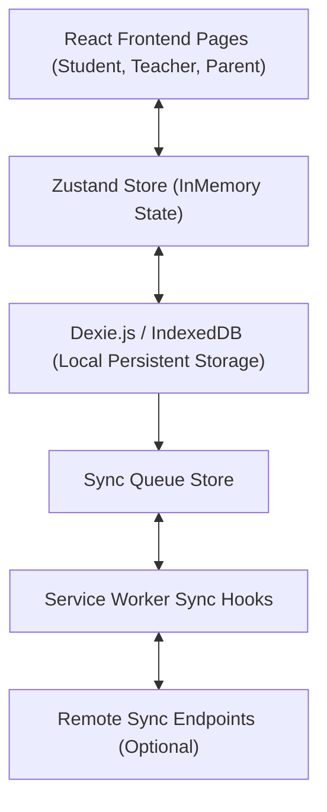

# Pathwise — PWA System Architecture

Pathwise is an offline-first Progressive Web App (PWA) designed for adaptive educational delivery in grades 1-10. This document covers the architecture topology, tech stack, data synchronization flows, state boundaries, and folder layouts.

---

## 1. System Topology
Pathwise runs client-side as a high-fidelity Progressive Web App. All core calculations (BKT mastery, SM-2 flashcard intervals, weakness metrics, and AI solver systems) execute locally.



---

## 2. Directory Structure & File Map

```txt
/better
├── src/
│   ├── main.tsx              # Application entrypoint
│   ├── App.tsx               # Routing, theme wrapper, and shell loading
│   ├── index.css             # Design token variables, global styles, and print layout overrides
│   ├── types/
│   │   └── index.ts          # Core interfaces (Quiz, Flashcard, User, BKT, Sync)
│   ├── lib/
│   │   ├── db.ts             # Dexie.js database schema & table initializations
│   │   ├── bkt.ts            # Bayesian Knowledge Tracing hidden Markov models
│   │   ├── sm2.ts            # SuperMemo-2 spaced repetition schedules
│   │   ├── difficulty.ts     # Zone of Proximal Development adaptation parameters
│   │   ├── weakness.ts       # Performance and consistency decay analysis
│   │   ├── ai-engine.ts      # Structured knowledge compiled solver & validator
│   │   ├── voice.ts          # Voice synthesis text-to-speech engine wrapper
│   │   └── utils.ts          # Id generators, clamps, and mathematical helpers
│   ├── store/
│   │   ├── appStore.ts       # General PWA state (sidebar, theme, network, language)
│   │   └── authStore.ts      # Active user sessions, onboarding profiles, and roles
│   ├── components/
│   │   ├── ui/               # Reusable buttons, cards, progress widgets, and modals
│   │   ├── mascot/           # SVG Gyani owl components with state speech bubbles
│   │   └── layout/           # AppShell, side navigation, mobile bottom navigation
│   └── pages/
│       ├── Landing.tsx       # Marketing, features review, and FAQ page
│       ├── auth/             # Onboarding, signup, and PIN-secured entry gates
│       ├── student/          # Adaptive dashboard, curriculum explorer, AI tutor chat
│       ├── teacher/          # Student grid directories, assignments creator, and classrooms
│       └── parent/           # Analytics charts and WhatsApp progress sharing triggers
```

---

## 3. Tech Stack Rationale

### 1. React 19 & TypeScript
- Core structure is built on React 19 to support hook boundaries and resource optimization.
- TypeScript enforces strict typings across quiz schemas, attempts, and BKT masteries to prevent runtime errors.

### 2. Dexie.js (IndexedDB)
- Native IndexedDB has a low-level event listener API which is verbose and prone to locks.
- Dexie.js wraps IndexedDB in an elegant Promise-based API, supporting transactional consistency, complex compound queries, and schema version control.
- This serves as the local database holding cached notes, diagrams, attempts, and chat messages.

### 3. Zustand Stores
- Lightweight, atomic state manager.
- Separates transient UI flags (like `sidebarCollapsed`) from local database calls.
- Integrates local storage persistence middleware (`persist`) to maintain sessions across browser refreshes.

### 4. Custom CSS Design Token System
- Design tokens are configured in CSS root variables for fast and light theme changes.
- Uses `color-scheme` properties to automatically theme scrollbars and native calendars.

---

## 4. State Synchronization Loop

### The Offline Transition
1. **Student action**: A student answers a quiz question.
2. **Local Update**:
   - `Quiz.tsx` calculates scores.
   - Updates BKT mastery probabilities in IndexedDB.
   - Recalculates weakness indexes.
3. **Zustand Action**: Stores XP rewards and updates student level.
4. **Queue Registration**: Saves a pending transaction object inside `syncQueue` (Dexie).
5. **Sync Service**:
   - The system queries `NetworkState`.
   - If online, it processes the queue sequentially, pushing updates to the remote server.
   - If offline, the queue remains in IndexedDB and updates when connectivity is restored.
